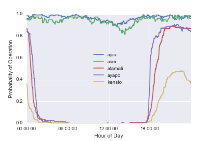

# Possible Titles

- Measurements of Microgrid Consumption in Lake Sentani, Indonesia
- Microgrid Energy Consumption, Uptime and Load Factor in Lake Sentani, Indonesia

# Abstract

## contributions

- measurement showing SAIDI on grids and microgrids are below the reported values for larger communities
- proposal and calculation of SAIDI for grids with evening schedules
- measurement of per capita daily energy use
- measurement of per capita max power

# Introduction

<!-- first paragraph: main issue -->
<!-- TODO: do I need a clearly stated research question? -->
<!-- TODO: how does this work further the goals of the energy access field in Indonesia -->
- This paper provides electricity consumption data and analysis useful to Indonesia's universal electricity access effort
    - By measuring key electricity parameters, we hope to add to the body of data
    - A richer body of data will lead to more robust technical, economic, and social designs for electricity

<!-- second paragraph: context and motivation -->
- indonesia is executing a large electrification expansion to achieve universal access (ADB paper)
    - has made progress on percent with electricity access over the last decades (ADB?)
    - the archipelago however presents challenges and there are wide differences in the electrification rate
    - least cost analysis identifies PV microgrids as the best option for some areas (ADB energy access)

<!-- third paragraph: reason study needed -->
<!-- academic community doesn't have data, does the electric utility? -->
<!-- TODO: is it clear that the purpose of paper is to add to consumption data to the literature? -->
<!-- TODO: is it clear why the paper is needed? -->
- electricity planning requires an accurate load estimation for financial viability
    - without this load estimation, getting investment is difficult (jaramillo)
    - researchers have demonstrated the lack of capital is partly due to lack of data (jaramillo?)

- distributed electricity increases the need for accurate load estimation
    - since DER is dominated by capital costs, the initial allocation is important
    - getting the load estimation is important and difficult (louie paper)
    - existing remote grids and diesel-powered microgrids give insight into the loads in similar neighboring areas

- this paper reports measurements of the load in an area with low electrification that are germane to investment
    - there are only a few published measurements of electricity use in these areas
    - we report on saidi, saifi, and load factor

- we compare the reliability of these measured grids to the country and area averages
    - SAIDI varies widely across the country
    - We observe SAIDI values well above the averages reported (ADB)
    - These SAIDI are closer to those observed in SSA (WB "doing business" 2016)

- the observed load factor in these areas is _________
    - load factor tells how difficult the load is to serve because of variations in the power demanded
    - kirubi measured the load factor in Mpetonka.  higher load factor is more efficient in capital allocation for the generation assets.
    - load factor can point to the need to promote assets to smooth this factor
    - distributed generation has a different requirement for load factor compared to fossil generation

- we include observations on the variation of electricity demand throughout the day
    - there is little published data on temporal patterns
    - energy and the time of day that energy is used tell us about the needs of the solar generation
    - power peaks also tell us about the needs of the generation equipment
    - these temporal data are necessary for allocating electricity generation equipment

- the paper is arranged in the following sections
    - methods
    - uptime results
    - schedule results
    - energy and power level results

# Methods

## Data Collection

- We measure 2 villages with connections to the main grid and 3 villages with diesel microgrids
    - The power meter records the power, voltage, and current.
    - The data is recorded at one-minute intervals.
    - These recordings were compiled from late April to July 2015
    - The main supply to each of these villages was fitted with a logging electrical power meter
    - The meter measurements are transmitted to a database over a communication network
    - Since the communication network wasn't fully robust, some gaps in the data exist

## Timeseries Synthesis and Quality

- Energy analysis techniques rely on a complete observation of the period under question.
    - Since these grids often have outages gaps in the data exist.
    - During a power outage, the meter conserves data and power by storing a single message for the power going down.
    - The one-minute observations are suspended until the power returns and a single message for power up is recorded.
    - Observations of zero grid voltage and zero power consumption can be inserted into the timeseries for these periods.
    - Other gaps in the timeseries record exist that do not correspond to a recorded message.
    - These gaps are left with null rather than zero values so that they do not bias our statistics.

- We quantify the fraction of the observation period with valid data.
    - Once we have synthesized a timeseries with as much data as available
    - The percent coverage is defined as the ratio of valid entries to the total time period.
    - A higher percent coverage will give us more confidence in the measurements we extract from the time series.

<!-- TODO: would it be easier to do the zero insertion from the raw data rather than after the fact? -->
<!-- TODO: is the network cellular and internet? -->
<!-- TODO: can I get information on the voltage threshold for a power down and up message? -->
<!-- TODO: write the make and model of the power meter and method of collection. -->
<!-- TODO: are we going to fill or interpolate any short data gaps? -->

## Uptime measurement data analysis

- From the meter data we can estimate the fraction of the time that power is available to the customers.
    - There are two possible methods for this estimation, one using event messages about power loss from the meter and the other using gaps in the timeseries data from the meter.
    - The meters sends a message that the power has been lost when the voltage drops below a certain level and also when the voltage has recovered.
    - The time difference between the power down messages and the following power up messages is computed and summed.
    - If the database is missing any of these event pairs, this method will underestimate the time without power.
    - During the time when the power is down, the meters do not record or transmit data.
    - By finding the gaps in the timeseries data that are longer than the one-minute reporting interval, we can estimate the time without power.
    - This method provides an overestimate because communication problems will also result in missing data despite power being available.
    - Both of these methods together provide an upper and lower bound for the time without power.
    - We extrapolate from our sample to the whole year assuming that the downtime statistics will be similar throughout the year.

<!-- TODO: is it possible to find timestamp gaps where the kWh export increments -->
<!-- TODO: can we combine the message and timestamp methods to get higher confidence in the measurement? -->
<!-- TODO: did the SATECs have local storage? -->
<!-- TODO: how do we explain that there may be unreported outages if there is a coincident data outage. -->

## Microgrid schedule data analysis

- From the data sets we can observe the adherence of the microgrid power availability to a fixed schedule.
    - Small diesel microgrids like these often operate only in the evenings to conserve fuel (cite).

- Using the data, we can observe the schedule and find the operation times of the grids.
    - We plot the probability of observing power as a function of the hour of day to infer the schedule.
    - The probability is defined as the number valid observations of power at time t divided by the number of valid observations of either power and blackout at time t.
    - A valid observation of power at time t is defined as having a time series observation of the power at time t.
    - A valid observation of blackout at time t, is defined as time t falling in a recorded gap observation.

<!-- TODO: what can we say about the average hours of operation? -->

- Using the data, we can then observe deviations from this schedule.
    - Any reliability metric we compute should be relative to the promised availability.
    - We compare the uptime to the promised schedule of reliability to form a meaningful indication.
    - The SAIDI metric measures the difference between the expectation between power that is always available to the available power.
    - From this we can create an adjusted metric, similar to SAIDI, that separates the expected unavailability of electricity from the unexpected.
    - Since the microgrid availability expectation is ~8 hours per night, the adjusted uptime percentage is the uptime percentage multiplied by a factor of 3.

<!-- TODO: We could use an uninterrupted night of service as one metric for scheduled service -->
<!-- TODO: we could take the average probability over the probabilities over a threshold to get the adjusted probability -->
<!-- TODO: think through if discarding unobserved blackouts or uptime biases the probability -->
<!-- TODO: how do we handle missing data? -->
<!-- TODO: resolve issue with unexpected daytime usage -->

## Energy and power consumption analysis

- From the metered data and the village populations we can estimate the per capita electricity consumption.
    - The meter records an energy accumulator that is reported at each timestamp with 1 kWh resolution.
    - This energy accumulation record is incomplete.
    - The meter does not record zeros when the grid power is unavailable
    - We resample the timeseries onto a one-minute time scale
    - Take the difference between neighboring minutes
    - Samples without valid data are assigned null values
    - We insert zeros into the time series during the recorded gaps by the meter
    - Only the times with data outages are represented by nulls.

- We use this synthesized record of minute-energy differences
    - By summing these accumulated energy differences over a day, we get the energy consumption.

- We report two electricity consumption averages.
    - We report an average for energy delivered on days or nights with full access.
    - We report another average for actual energy delivered each day.
    - The first average gives the potential energy consumption for the system when it is fully operational without technical or operational constraints.
    - The second average is the actual electricity delivered.
    - The difference between these two provides a measure of latent demand.

- We define full access differently for the two grid types
    - For the centralized grid, we define full access as a day with above a threshold level of grid operation and data coverage over a 24 hour period.
    - Since the microgrids only operate in the evening, we define full access as an evening of access without interruption.

<!-- TODO: get the village populations to create per&#45;capita estimates -->
<!-- TODO: will we consider days with valid midnight samples but data missing during the day? -->

## Load Factor

- the load factor is the average load divided by the peak load
    - since the average load is related to the revenue and the peak load is related to the capital investment, low load factors are difficult to service
    - we report one load factor for the average load when the grid is functioning
    - I report a second load factor for the actual average load (how should I define this?)

<!-- TODO: is there a source for a recommended load factor for financial sustainability?  could I estimate this from solar costs? -->

# Results

## Data Coverage

- The data cover from two to three months in the villages.
    - While there are gaps in the data, there is valid data for at least 86% of the time in all villages.
    - One grid-connected village has over 99% of the time accounted for with a valid data entry.
    - These gaps are most likely due to data transmission issues.
    - We have no robust way of the presence or absence of power in the data gaps with the data set available.

<!-- TODO: can we use the increase in accumulated energy to infer a data gap with power present? -->
<!-- TODO: do I think these missing data will bias uptime or downtime measurements? -->
<!-- TODO: are statistics of these data gaps different than the power gaps?  if so, how? -->

| Village   | Start Date | End Date   |   Duration |   Coverage |
|:----------|:-----------|:-----------|-----------:|-----------:|
| Ajau      | 2015-04-22 | 2015-08-28 |   128.481  |   0.993579 |
| Asei      | 2015-04-22 | 2015-07-09 |    78.6889 |   0.968477 |
| Atamali   | 2015-04-24 | 2015-08-26 |   124.065  |   0.863161 |
| Ayapo     | 2015-04-22 | 2015-08-27 |   127.433  |   0.904552 |
| Kensio    | 2015-05-11 | 2015-08-21 |   102.194  |   0.92657  |

## Centralized Grid Uptime

- The observed uptimes on these grids is below the averages for the Papua region.
    - IISD GSI report shows the Papua system with a SAIDI of about 2 hours per customer.  This data is from PT PLN (Persero) 2014
    - The observed grid uptime of approximately 95% translates to a SAIDI of around 440.  This is over one hour per day.

- The two grid locations show uptime that is well over 90% at times of day.

<!-- TODO: use a cumulative plot of message downtimes to show the most disruptive outage durations -->
<!-- TODO: what is the explanation for such a departure? -->
<!-- TODO: create a table with uptimes for each village name, uptime, type of grid -->

## Microgrid Uptime

- To conserve fuel, many microgrids are only operated in the evenings. (cite Schnitzer?)
    - These microgrids are mostly operated between the hours of X and Y according to the data.
    - During these times, we observe outages of Z frequency.
    - The microgrids reflect an uptime that is reasonable given that electricity is only promised to be available 6-8 hours per day.
    - Atamali and Ayapo showed 33% uptime while Kensio had 16%
    - If electricity is promised 8 hours per day, an uptime of 33% would be perfect.
    - At the highest probability times in the evening, the probability peaks at about 80%.
    - There are times of day when the microgrid is never observed to be running.

<!-- TODO: is there any literature on microgrid uptimes? -->
<!-- TODO: what is a more specific way than uptime to show the deviation from a promised schedule? -->
<!-- TODO: how do micogrid uptimes compare to perfect uptime?  How do I make this comparison clearly? -->
<!-- TODO: what comparison will you make? -->

## Electricity Consumption

- grid locations have higher per capita electricity consumptions per day than the microgrid

- we compare the per capita electricity consumptions to the Indonesia and Papua averages published by ADB/IISD/PLN

- In 2013, PLN reported 218 kWh sold per capita per year.
    - reported 3.9 persons per household

- Grid locations have much higher (on the order of 10x) greater mean electricity consumption per household.

|         |   days observed |   mean kWh per day |   median kWh per day |
|:--------|----------------:|-------------------:|---------------------:|
| Ajau    |             129 |          600.388   |                609   |
| Asei    |              78 |          180.038   |                186   |
| Atamali |             110 |           15.0545  |                 16   |
| Ayapo   |             117 |           84.9829  |                 95   |
| Kensio  |              98 |            5.31633 |                  1.5 |

|         |   days observed |   mean kWh per day per household |   median kWh per day per housheold |
|:--------|----------------:|---------------------------------:|-----------------------------------:|
| ajau    |             129 |                         4.96188  |                            5.03306 |
| asei    |              78 |                         5.45571  |                            5.63636 |
| atamali |             110 |                         0.376364 |                            0.4     |
| ayapo   |             117 |                         0.825077 |                            0.92233 |
| kensio  |              98 |                         0.265816 |                            0.075   |

<!-- TODO: how does the max kWh per day per household compare? -->
<!-- TODO: find and cite the per capita electricity consumption -->
<!-- TODO: use boxplot or something to get better indication of statistics -->
<!-- TODO: where can I find village populations? Did Joshua Ferrer do this? -->
<!-- TODO: how do both of the per capita electricity consumption estimates compare to the published Indo values. -->

## Load Factor

- we report the peak power per capita on the microgrids and normal grids

<!-- Q: will we attempt to estimate the extra revenue required to get to full SAIDI for microgrids? -->

# Discussion

# Conclusion

