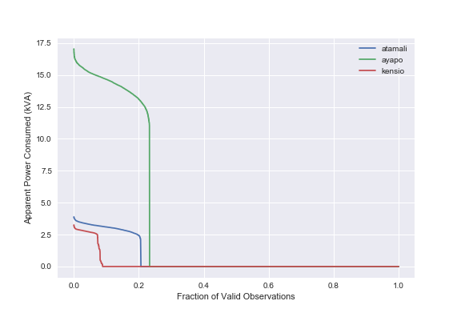
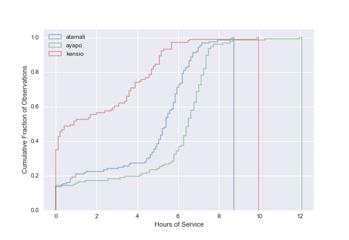

# Key Questions

- What are the observed costs of electrical energy on these microgrids?
- How reliable is the electricity on these microgrids?

# Contributions

- estimations of specific fuel consumption for electricity generation on diesel microgrids

# Possible Titles

- Microgrid Marginal Electricity cost in Lake Sentani, Indonesia
- Measurements of Microgrid Consumption in Lake Sentani, Indonesia
- Microgrid Energy Consumption, Uptime and Load Factor in Lake Sentani, Indonesia

# Abstract

# Introduction

<!-- p1: main issue: quantifying observed diesel marginal cost  -->

- this paper establishes the observed marginal cost of diesel generation in a remote area
    - least cost assumptions that drive energy allocations are dependent on operating conditions
    - we observe operating conditions that are likely to cause high operating costs
    - we measure operating costs that are well above assumptions and recovery tariffs

<!-- p2: context, motivation, need: keeping indonesia on track -->

- indonesia is executing a large electrification expansion to achieve universal access (ADB paper)
    - Indonesia has made progress on percent with electricity access over the last decades (ADB?)
    - we want to simultaneously expand access, lower cost and lower carbon intensity
    - the archipelago however presents challenges and there are wide differences in the electrification rate
    - This assumption would be threatened by oversized generators.
    - Observations of marginal cost can inform future allocations in Indonesia and beyond.
    <!-- is diesel the dominant technology in Indonesia?  (ADB)  -->
    <!-- at what time were these grids installed? -->

<!-- p3: lit search shows this study fills a data and analysis gap -->

- least cost electrification needs data to support its assumptions
    - these establish a range of diesel operating costs to use in future least-cost studies
    - geospatial least cost studies show continuing diesel use as a significant part of the mix (ADB_AUEAII)
    - least cost assumptions are sensitive to operating costs (ADB_AUEAII)
    - A diesel microgrid in Nicaragua runs at well below the generator rating (Casillas_EP)
    - Indonesia diesel plant electricity production flattening out (ESDM)
    - In the case of PV, oversizing leads to higher costs (Louie_ESD, Lee)
    - Grids in Haiti show oversized grids infrequently operated (Schnitzer_Thesis)
    - evidence shows that tariffs are below operating costs in Haiti and that few if any grids are operating (Schnitzer_Thesis)
    - This study adds to the literature by gathering minute-resolution load data

<!-- p4: results -->

- this study provides estimates and observations of the fuel costs for diesel consumption in three indonesian microgrids
    - this work makes two contributions
    - first, an observation of the specific fuel consumption in three microgrids
    - second, a modeled estimate of the specific fuel consumptions for well-maintained generators
    - we find that the generators are providing power well below their intended operating points
    - we estimate that a new generator operating at these low power operating points would have operating costs at 0.60 USD or above
    - we find that the observed specific fuel consumption with an installed generator on one grid is as high as 2 USD per kVA-hour delivered, suggesting significant efficiency degradation

<!-- p5: conclusions -->

- These results suggest diesel microgrids may not be performing to expectations
    - when the generator is run at low loads marginal cost and carbon emissions rise
    - areas with high marginal costs should be identified and mitigated
    - right-sized generators or alternate technologies should be considered for areas with high marginal costs

# Methods

## Data Collection Context

<!-- where and how was the data collected? -->

- We measured the energy and power delivered to 3 villages with diesel microgrids
    - These villages are in the Lake Sentani region of Indonesia
    - These recordings were compiled from late April to July 2015
    - The main supply to each of these villages was fitted with a logging electrical power meter
    - The power meter records the power, voltage, and current.
    - The data is recorded at one-minute intervals.
    - The meter measurements are transmitted to a database over a communication network
    - Accumulated energy is reported in units of kilowatt-hours
    - The apparent power is reported in units of volt-amps

## Data Coverage

- We report the interval of time that is covered by data
    - Since the communication network wasn't fully robust, some gaps in the data exist
    - We receive measurements at regular intervals during grid operation
    - We receive reports when the grid ceases operation and returns
    - We sum these periods of time to report the fraction of time covered by the data record

## Missing data techniques and data integrity

<!-- TODO: should this go before or after the energy and power methods? -->
<!-- TODO: what do we do to ensure correct data? -->

- We synthesize time series data for the times when the grid isn't running
    - During power outages, we insert observations of zero power and energy consumption at the same frequency as the meter observations.
    - There remain times without a measurement or confirmed period of power off
    - We remove anomalies due to data corruption in the record

## Energy consumption analysis

<!-- TODO: what is the right level of detail to report here? -->

- We report the daily energy use in the microgrid from the accumulated energy timeseries
    - The meter records an energy accumulator that is reported at each timestamp with 1 kWh resolution.
    - To account for gaps we insert zeros during reported downtime as described above.
    - We resample the timeseries onto a one-minute time scale
    - Take the difference between neighboring minutes
    - Samples without valid data are assigned null values that aren't included in sums or means
    - By summing these energy differences over a day, we get the energy consumption.

## Power Consumption Analysis

- We report the power used on the grids from the apparent power timeseries
    - The meter provides the apparent power in kVA averaged over an interval at each time step.
    - These data are reported as a mean power for each time of day and as a load duration curve

- We construct a typical daily load profile from an average of the apparent power observations.
    - We plot the mean load by averaging the valid observations for each minute in over all the observation period.
    - These mean power are then plotted with the time of day as the independent variable.

<!-- TODO: determine how to plot quartiles on load profile -->

- We construct a load duration curve to show the percentage of time that the grid is supplying a given power level.
    - We sort the time series in descending order
    - We normalize the independent variable onto to a scale of zero to one so that the plot represents the time the grid is running.
    - It is essentially a cumulative distribution function with the axes reversed

## State of the art fuel estimation

- We estimate the best possible cost per kWh of generation on the microgrids assuming the datasheets for high quality genset performance and the observed loads.
    - Generators become less efficient in fuel use per energy delivered as the load is decreased
    - We find specification sheets for a generators of similar size from a leading manufacturer
    - Specification sheets report fuel use at 25%, 50%, 75%, and 100% of the full load.
    - We assume a linear relationship between fuel use and generator load.
    - We take the published curves for fuel use and extrapolate to the low loads observed on microgrids
    - We divide the fuel rate by the apparent power to get the instantaneous specific fuel consumption
    - Using these fits, we can create a time series of fuel rates from the observed load data
    - Following the method used to construct a load duration curve, we create a specific fuel consumption duration curve
    - This curve has the specific fuel consumption in liters per kVA-hour as the independent variable

## Observed fuel use

- We estimate the per kWh cost of generation in real-world conditions from the delivered energy and the reported fuel use.
    - Logs are kept of fuel input to the generator on a nightly basis.
    - We divide the mean fuel per night as reported in the written log with the mean generation per night to get the overall specific fuel consumption

<!-- TODO: how do we know the sizes of the generators? -->

# Results

## Data Coverage

- We have confidence in the data for 86% to 93% of the observation period for the microgrids
    - The data cover from two to three months in the villages.
    - We have direct time series measurements for 9 to 23 percent of the observation period
    - We have messages indicating the grid going off and back on that bring coverage up to 86 to 93 percent.
    - We have no robust way of the presence or absence of power in the data gaps with the data set available.

| Village   |   Duration (days) |   Percent data |   Percent known downtime |   Total Coverage |
|:----------|------------------:|---------------:|-------------------------:|-----------------:|
| atamali   |           124.065 |      0.1904    |                 0.67276  |         0.863161 |
| ayapo     |           127.433 |      0.232502  |                 0.672051 |         0.904552 |
| kensio    |           102.194 |      0.0893443 |                 0.837226 |         0.92657  |

<!-- SI_data_integrity -->

## Electricity Energy Consumption

- TODO: this section can't be finished until energy zero insertion is implemented and tested
- TODO: revise cumulative distribution plot for daily energy consumption to include zero insertion
- TODO: create a table with village, mean kWh per day operating, mean kWh all time, number of connections
- TODO: decide if on presenting per household and per capita

- We report on daily electricity energy consumption
    - daily energy on days of operation
    - daily energy over entire valid observation period

|         |   days observed |   mean kWh per day |   median kWh per day |
|:--------|----------------:|-------------------:|---------------------:|
| Atamali |             110 |           15.0545  |                 16   |
| Ayapo   |             117 |           84.9829  |                 95   |
| Kensio  |              98 |            5.31633 |                  1.5 |

|         |   days observed |   mean kWh per day per household |   median kWh per day per housheold |
|:--------|----------------:|---------------------------------:|-----------------------------------:|
| Atamali |             110 |                         0.376364 | 0.4     |
| Ayapo   |             117 |                         0.825077 | 0.92233 |
| Kensio  |              98 |                         0.265816 | 0.075   |

## Power Consumption

- TODO: clean up date axis on hourly_kVA.png
- TODO: create time series percentile plot for hourly profile
- TODO: table (mean kVA, rated kVA, percent of load, number HH, mean kVA per household)

- We report on the apparent power consumption in these microgrids
    - The mean loads are 2.2, 2.8, and 13 kVA
    - All of these are well below 50% of the rated load of the generator
    - The most well-matched microgrid is operating at 32% of the rated load and one grid is only at 6% of the load.
    - There are relatively small fluctuations in operating load during the evening
    - The microgrids have an evening peak as well, but aren't running during the day.
    - We display the averaged power profile for the three microgrids
    - We display a load duration curve
    - The load duration curve for the microgrids shows one broad level of power demand.
    - It also shows long durations of no power delivery.

Table: Total and per connection apparent power

|    |   HH |   kVA factor |   max kVA |   max kVA per HH |   mean kVA |   mean kVA per HH | village   |
|---:|-----:|-------------:|----------:|-----------------:|-----------:|------------------:|:----------|
|  0 |   40 |     0.73535  |     3.884 |         0.0971   |    2.8561  |         0.0714024 | atamali   |
|  1 |  103 |     0.767282 |    17.041 |         0.165447 |   13.0753  |         0.126944  | ayapo     |
|  2 |   20 |     0.690428 |     3.253 |         0.16265  |    2.24596 |         0.112298  | kensio    |

Table: Generator Utilization

|         |     mean |   rating (kVA) |   percent genset load |
|:--------|---------:|---------------:|----------------------:|
| Atamali |  2.8561  |             25 |             0.114244  |
| Ayapo   | 13.0753  |             40 |             0.326881  |
| Kensio  |  2.24596 |             35 |             0.0641703 |

## Microgrid Marginal Cost

- data sheet fuel consumption per hour
TODO: table (village, fuel consumption per hour at 100%, 50%, operating point)

- ideal specific fuel consumption
- ideal specific fuel consumption duration curve
- observed nightly fuel consumption
- observed specific fuel consumption

TODO: table (village, specific fuel consumption at 100%, 50%, mean operating point, observed SFC)

- The figure shows the ideal specific fuel consumption.
    - It assumes the fuel consumption matches the data sheet
    - In practice, we expect wear and tear to reduce the efficiency of the generator.

TODO: create table (village, genset rating, expected SFC, observed SFC)

- Observations of fuel consumption are from operator reports
    - Atamali reports 30 liters per night for its 25 kVA genset to deliver 15 kWh
    - This results in a specific fuel consumption of 2 liters per kWh.
    - Ayapo reports 60 liters per night for its 40 kVA genset to deliver 85 kWh
    - This is a specific fuel consumption of 710 ml per kWh, well above predicted.
    - At 1 USD per liter for diesel, this is a marginal cost of 0.70 USD and 2 USD per kWh

## Microgrid Uptime

- To conserve fuel, many microgrids are only operated in the evenings. (cite Schnitzer?)
    - These microgrids are mostly operated between the hours of X and Y according to the data.
    - During these times, we observe outages of Z frequency.
    - The microgrids reflect an uptime that is reasonable given that electricity is only promised to be available 6-8 hours per day.  (cite MBPC)
    - Atamali and Ayapo showed 33% uptime while Kensio had 16%
    - If electricity is promised 8 hours per day, an uptime of 33% would be perfect.
    - At the highest probability times in the evening, the probability peaks at about 80%.
    - There are times of day when the microgrid is never observed to be running.

- Cumulative distribution plots show the most frequent durations.
    - One microgrid shows 6 hours of operation per day on about 75% of the days.
    - Another microgrid shows over 5 hours of operation per day on 60% of the days observed.
    - One microgrid, however, shows very few days with more than 5 hours of service.

<!-- TODO: is there any literature on microgrid uptimes? -->
<!-- TODO: what is a more specific way than uptime to show the deviation from a promised schedule? -->

# Discussion

- at $400 per kW, $1 per liter, and 300 ml/kWh, fuel cost exceeds capital cost after about 1000 hours, making generator replacement feasible (confirm)
- an efficient diesel generator has comparable cost and carbon intensity compared to existing fossil sources
- diesel cost and carbon intensity can match or greatly exceed coal and NG averages
- while PV costs rise on a capital basis, diesel costs rise on a marginal basis
- marginal costs are often more difficult because operation and maintenance isn't well handled

- We report two electricity consumption averages.
    - We report an average for energy delivered on days or nights with full access.
    - We report another average for actual energy delivered each day.
    - The first average gives the potential energy consumption for the system when it is fully operational without technical or operational constraints.
    - The second average is the actual electricity delivered.
    - The difference between these two provides a measure of latent demand.

- we compare the per capita electricity consumptions to the Indonesia and Papua
- averages published by ADB/IISD/PLN

Operation of the generators at an inefficient operating point wastes diesel fuel and drives up operating costs.

- Operating a diesel generator at a power load well below its designed operating point leads to inefficient operation.
    - This inefficiency increases fuel cost per unit of energy generated.
    - Ayapo retains a reasonable fuel rate close to the designed operation of the generator.
    - Atamali and Kensio with average loads at 11 and 6 percent of the design have theoretical specific fuel consumptions (SFC) of 460 ml per kVA-hour and 970 ml per kVA-hour.
    - This operation could increase wear and tear on the generator, increasing maintenance costs and downtime.

- The operating costs are well above the tariffs
    - Customers pay 5 cents or less per kWh and many meters don't function
    - The observed marginal costs due to fuel well exceed this

- This is far above the our ideal fuel consumption estimate for Atamali.
- Tariffs in the area are below 5 cents per kWh so the electricity is almost completely subsidized

# Conclusion

