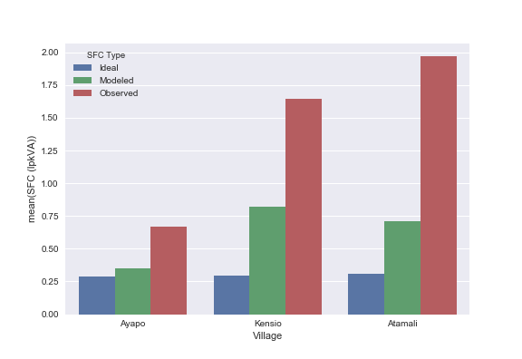

# Abstract

Supplying electricity to the remaining unconnected populations requires cost-effective distributed sources of electricity generation.
Diesel reciprocating engine generators are a popular generation source because of their low capital cost but can have high operating costs.
Little data exists for the real-world behavior and operating costs on installed diesel micro-grids.
We report on the energy delivery and fuel consumption on three diesel micro-grids in the Lake Sentani region of Indonesia.
We find that these generators are sometimes operated below their capacity and that the diesel cost to electricity delivered ratio can be over five times greater than what we expect from the manufacturer specifications.
These estimations of the specific fuel consumption suggest that diesel in practice is not always a least cost technology and other options should be carefully considered.

# Introduction

The electrification of the remaining 1.2 billion people without access requires a close attention to costs.
Indonesia is executing a large electrification expansion to achieve universal access [@ADB_AUEAII].
Indonesia has made significant progress reducing the number of households without electricity access over the last decades.
A significant fraction of the remaining households are beyond the reach of centralized grids and will require decentralized solutions.
Indonesian planning documents based on least-cost studies show diesel generators as a significant part of the new electricity supply [@ADB_AUEAII; @IEEFA; @RUPTL].
To ensure the delivery of electricity at the lowest price, the operating costs should be compared to assumptions over time.
If these operating costs are significantly different from the assumptions, the electrification plan should be revisited.

Previous work has shown problems with diesel generation but there are few examples of direct modeling and measurement of the fuel used per unit of electricity delivered (specific fuel consumption or SFC).
Grids in Haiti show problems with loads below the capacity of the generator that lead to infrequent operation over limited hours.
These problems make sustainable financial operation of the microgrids very difficult and many have fallen into disuse.
[@Schnitzer_Thesis].
A diesel microgrid in Nicaragua also runs at well below the generator rating [@Casillas_EP].
In the case of photovoltaic (PV) electricity, having components that provide more energy than is being used leads to higher costs [@Louie_ESD, @Lee].
Diesel generators that can deliver more power than is required by the customers can lead to higher fuel costs and generator degradation over time [@Hove_Tazvinga].

This study provides modeled and observed costs for diesel consumption in three microgrids in the Lake Sentani region of Indonesia.
We find that two generators are providing power well below their intended operating points.
Using a model based on the manufacturer specifications for several generators, we estimate that these generators would use 0.7 liters per kWh of electricity or above.
This is about twice the value for a well-maintained generator operating according to its specifications.
The observed fuel use reached as high as 1.97 liters per kWh suggesting serious fuel inefficiency likely due to issues of generator maintenance.

These results suggest that diesel micro-grids operating outside of centralized grid areas may not be performing to the expectations of the electricity planners.
Areas that are struggling with high costs of electricity delivery can estimate the SFC of their generators to check for degradation or insufficient loads.
These micro-grids could be retrofitted with diesel generators that are a better match to the load or with alternative electricity generation technologies.
Improving these operating costs could improve the financial viability on these existing grids and inform future electricity planning.

# Methods

We model and estimate the fuel use per unit of electrical energy delivered (specific fuel consumption or SFC) for three village microgrids.
Power and energy data from data logging meters are collected, cleaned, and analyzed to extract the energy and power delivered.
We create a model of generator fuel consumption as a function of the rated power and delivered power based on the specification sheets of nine comparable generators.
The observed power during operation and rated energy size is used to infer the SFC for each of the three microgrids.
To estimate the actual observed SFC we take the ratio of the reported fuel use per day by the operator and the measured energy use per day.

We measured the energy and power delivered to three villages with diesel microgrids using data logging meters.
The recordings were compiled from late April to July 2015 as part of the work of a private microgrid provider in the area.
The meters were placed at the main output of the generator and measured the energy delivered to the village distribution system.
The data logger measured power in volt-amps and accumulated energy in kilowatt-hours at one-minute intervals.
These measurements were transmitted over a communication network to a database for storage.

We assemble a time series record from our record of data.
There are three possibilities in the data recording process.
One, the meter and generator were properly functioning and data was stored on one-minute intervals.
Two, the meter is properly functioning and the generator was dormant and a data point for the shutdown and startup of the generator was stored.
Third, the meter or communication networks were not functioning properly and no data is in the record.
We account for each of these possibilities as we assemble the time series of generator data.

We model the cost per kWh of generation on these microgrids using a linear fit of manufacturer generator specification data from nine specification sheets from three manufacturers.
All specification sheets report the fuel use in liters per hour as a function of the power delivered by the generator (load).
The fuel rate is reported while delivering power at 50%, 75%, and 100% of the rated load while some also include a 25% data point.
We assume a linear relationship between the fuel rate and the delivered power.
We produce a linear fit to each generator.
The slope of the fit is the increased fuel rate for each additional kW of power delivered.
The intercept of the fit is the fuel rate with no power delivered (no-load fuel consumption).
The mean of the slopes and intercepts are used to create a linear model of fuel use for a general generator.
Dividing by the fuel rate by the power delivered yields the specific fuel consumption.
The observed average power of operation for each microgrid is fed into this linear model to predict the SFC for each generator.

We also estimate the per kWh cost of generation in real-world conditions on these grids from the delivered energy and the reported fuel use.
Operators keep logs of the approximate fuel use per day for the microgrids.
The ratio of this fuel use over time and the total energy delivered over that time period gives the observed specific fuel consumption and thus the marginal cost of fuel for the grids.

# Results

The combined data observations cover the majority of the observation time period.
The data cover at least 86% of the observation period on the three microgrids.
@tbl:data_coverage shows that there are direct observations over 9% to 23% of the observation periods where the grid is operating.
The indirect observations are from periods where the meter was operating but not taking one-minute samples while the grid wasn't operating and zero electricity delivery was assumed during these periods.

Table: Data Coverage {#tbl:data_coverage}



The daily electricity energy consumption per household is modest and shows high variability on two grids (@fig:daily_energy_CDF).
<!-- The daily electricity energy consumption on the days the grid is operating is between 0.4 and 0.9 kWh per day per household (@tbl:daily_operating_energy). -->
We define operation as any day where any energy was delivered to households.
The cumulative distribution function (CDF) in @fig:daily_energy_CDF shows that the electricity on most days is clustered around a central value but that there is a tail of lower values.

{#fig:daily_energy_CDF}

<!-- Table: Mean Energy Delivered During Grid Operation {#tbl:daily_operating_energy} -->

<!--  -->

The power delivered to the households during operation is below the rated power for the generators.
@tbl:genset_utilization shows the mean load during operation of the microgrids.
The microgrid with the highest utilization is operating at 33% of the rated load on average and the lowest is at 6%.
These means do not include the periods of zero power when the generator is not operating and fuel isn't being consumed.
@fig:power-CDF includes times when the grid is not operating.
It shows that although there is a significant tail of zero power, two of the grid distributions don't have long tails.
The Kensio grid however shows a low-power non-zero tail.

{#fig:power-CDF}

Table: Generator Utilization {#tbl:genset_utilization}



The specific fuel consumption regression model has a no-load fuel conumption of 1.39 liters per hour and a marginal fuel rate of 0.256 liters per hour per additional kW delivered.
The r-squared values for each of the fits is above 0.98.
The standard deviation of the marginal fuel rate is 0.019 liters per hour per kWh which is about 7% of the mean.
The extrapolated no load consumption had much more variation with the standard deviation at 46% of the mean.

The modeled specific fuel consumption exceeds the specific fuel consumption for a generator operating at its peak (@fig:SFC-bar-graph).
Ayapo, with an average operating load of 33% of the rated load, increases fuel consumption by about 20% from the value at 100% load.
Kensio has an average load of 6% of the rated load which increases the specific fuel consumption by over a factor of two from the optimal.

<!-- Table: Modeled Specific Fuel Consumption {#tbl:modeled_SFC} -->

<!--  -->

The observed specific fuel consumption greatly exceeds the expected SFC on two of the grids.
The observed fuel consumption is as high as 2 USD per kWh.
@tbl:observed_SFC shows the reported average fuel use per night as reported by operators, as well as the mean energy on operating days and the observed specific fuel consumption (@no_cite_yet).
These observed fuel uses exceed the modeled specific fuel consumption for all grids.

Table: Observed Specific Fuel Consumption {#tbl:observed_SFC}



{#fig:SFC-bar-graph}

# Discussion

<!-- high marginal costs contradict the assumptions for diesel costs -->
<!-- high marginal costs may mean diesel is not the least&#45;cost option -->

Higher than expected marginal costs have electricity planning impacts.
Low loads leading to high specific fuel costs erode the least-cost advantage of diesel generation.
These higher specific fuel costs make delivery of energy expensive reducing the time service is available.
The costs suggest that improvements be investigated.

<!-- Diesel and Least Cost Assumptions -->

Operating diesel generators at low loads reduces the rate of fuel use but increases the rate of fuel use per unit of energy delivered.
Over time, this lo load operation increases engine maintenance requirements and degrades performance. [@Schnitzer_Thesis, @Hove_Tazvinga]
Two of these generators operate in a regime that causes a significant increase in the specific fuel consumption relative to the intended operating point of the generator.
The observations of fuel use well above the model prediction suggests that these generators have seen performance degradation due to wet-stacking due to the low operation points.

If these observed fuel costs in operation but the total levelized cost above another option, least-cost planning hasn't been achieved.
Diesel generators are attractive because they cost the least to purchase and install per kW among any generation source.
However, the high fuel costs relative to other options put them on the high end of levelized cost [@Lazard_LCOE].
This can create a split incentive problem if the fuel costs are not borne by the installer of the generators.
Despite the relatively high cost of electricity, in areas beyond the centralized grids, diesel is a viable option.
The observed fuel rates we observe in some grids are well above levelized cost estimations for diesel of 0.20--0.28 USD per kWh.
Our data suggest that the assumption that diesel is the least cost option should be revisited for many operating grids.

<!-- &#45; The observed fuel costs are well above the tariffs charged on the grids requiring subsidy -->
<!--     &#45; Customers pay 5 cents or less per kWh and many meters don't function (personal communication) -->
<!--     &#45; This suggests electricity is almost completely subsidized similar to other grids [@Schnitzer_Thesis] -->
<!--     &#45; While there is insufficient cost recovery even if running efficiently, degraded generators exacerbate this problem. -->

<!-- Inefficient Operation and Level of Service -->

Grids operate in the evening and service is often curtailed both in the amount of time operating and the amount of energy delivered.
The Atamali provides between 5 and 7 hours 75% of the observed days
The Ayapo grid provides between 4 and 7 hours on about 75% of the observed days
The Kensio microgrid, however, shows very few days with more than 5 hours of service.
@fig:uptime_CDF shows that two grids don't operate at on 15% of the days and another on 35% of the days.
To conserve fuel, many microgrids are only operated in the evenings since the consumer demand is the highest at those times. [@Schnitzer_Thesis,  @Casillas_EP, @no_cite_yet]
Consumers on these grids take turns purchasing the kerosene for the night on the grids.
Higher specific fuel consumption increases pressure to restrict operating hours to reduce fuel use.
While the village nominally has been electrified it has an expensive and intermittent electricity service.

{#fig:uptime_CDF}

<!-- Potential Improvements -->

These problems of high marginal costs and insufficient tariff recovery suggest that other approaches could provide better service at a lower cost.
Revisiting the least cost assumptions in actual operation may lead to different generation allocation decisions.

In areas where the loads are much lower than the operating points of the generators, matching new smaller generators to the customer loads would improve SFC and operating and maintenance costs.
A smaller generator operating at or above 75% of the rated load will maintain a reasonable SFC.
The very low initial cost of purchasing a generator and high fuel cost allow this replacement to pay back quickly.

At the very high fuel costs observed in some villages, replacing diesel generation with PV and battery storage could improve levelized cost.
Using the Lazard levelized cost of energy (LCOE) and levelized cost of storage LCOS studies we can create a composite estimate of 1.22 -- 1.56 USD per kWh for PV and storage. [@Lazard_LCOE @Lazard_LCOS]
While this is a high LCOE it is below the observed fuel cost for one of the villages and invites us to reconsider the least cost assumptions.
While the levelized cost of a battery and PV system may be lower, the capital investment is much higher.
With sufficient battery storage, it is possible to provide energy throughout the day.
If these additional service hours could increase revenue on these grids it
Increased revenue on these photovoltaic grids due to increased service hours could improve the financial viability of the projects.
Since PV is expensive on a capital basis, but diesel is expensive during operation, providing solar electricity would require new ways to access capital.

# Bibliography
