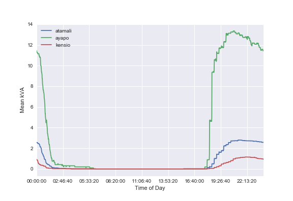

# Key Questions

- What are the observed costs of electrical energy on these microgrids?
- How reliable is the electricity on these microgrids?

# Contributions

- estimations of specific fuel consumption for electricity generation on diesel microgrids

# Possible Titles

- Microgrid Marginal Electricity cost in Lake Sentani, Indonesia
- Measurements of Microgrid Consumption in Lake Sentani, Indonesia
- Microgrid Energy Consumption, Uptime and Load Factor in Lake Sentani, Indonesia

# Abstract

# Introduction

<!-- p1: main issue: quantifying observed diesel marginal cost  -->
- this paper establishes the observed marginal cost of diesel generation in a remote area
    - this establishes the current cost of energy for renewable sources to compare against
    - evidence shows that tariffs are below operating costs in Haiti and that few if any grids are operating (Schnitzer_Thesis)
    - least cost assumptions are dependent on operating conditions

<!-- p2: context and motivation: keeping indonesia on track -->
- indonesia is executing a large electrification expansion to achieve universal access (ADB paper)
    - has made progress on percent with electricity access over the last decades (ADB?)
    - the archipelago however presents challenges and there are wide differences in the electrification rate
    <!-- is diesel the dominant technology in Indonesia?  (ADB)  -->
    - geospatial least cost studies show diesel as a significant part of the mix (ADB_AUEAII, modi?).  This assumption would be threatened by oversized generators.

<!-- p3: reason study needed: least cost electrification efforts need the best data -->
- least cost electrification needs data to support its assumptions
    - measuring the percent utilization of diesel generators gives a more accurate estimate of cost for comparison
    - we want to simultaneously expand access and lower carbon intensity
    - A diesel microgrid in Nicaragua runs at well below the generator rating (casillas 2010)

<!-- p4: summary? -->
- diesel cost and carbon intensity can match or greatly exceed coal and NG averages
    - an efficient diesel generator has comparable cost and carbon intensity compared to existing fossil sources
    - when the generator is run at low loads marginal cost and carbon emissions rise
    - generator sizes are often greatly oversized, adding to cost (casillas, schnitzer)
    - in the case of photovoltaics, oversizing systems adds to system cost (louie, lee)
    - while PV costs rise on a capital basis, diesel costs rise on a marginal basis
    - marginal costs are often more difficult because operation and maintenance isn't well handled
    - at $400 per kW, $1 per liter, and 300 ml/kWh, fuel cost exceeds capital cost after about 1000 hours, making generator replacement feasible (confirm)

<!-- p5: summary? -->
- this study provides estimates and observations of the fuel costs for diesel consumption in three indonesian microgrids
    - we combine timeseries load and accumulated energy data with generator specifications to estimate fuel use
    - low utilization of generator capacity leads to marginal costs higher than usual expectations
    - we find these estimates to be optimistic relative to the observed diesel consumption
    - the operator fuel logs suggest fuel use well above the predictions for a well-maintained generator at the same operating points
    - areas with high marginal costs should be identified
    - right-sized generators or alternate technologies should be considered for areas with high marginal costs

# Methods

## Data Collection

<!-- where and how was the data collected? -->

- We measure 3 villages with diesel microgrids
    - The power meter records the power, voltage, and current.
    - The data is recorded at one-minute intervals.
    - These recordings were compiled from late April to July 2015
    - The main supply to each of these villages was fitted with a logging electrical power meter
    - The meter measurements are transmitted to a database over a communication network
    - Since the communication network wasn't fully robust, some gaps in the data exist

## Energy consumption analysis

<!-- TODO: explain and demonstrate in SI if the sampling technique is robust or not to missing data -->

- From the metered data and the village populations we can estimate the per capita electricity consumption.
    - The meter records an energy accumulator that is reported at each timestamp with 1 kWh resolution.
    - This energy accumulation record is incomplete.
    - The meter does not record zeros when the grid power is unavailable
    - TODO: what interpolation methods will we apply for missing data?
    - We resample the timeseries onto a one-minute time scale
    - Take the difference between neighboring minutes
    - Samples without valid data are assigned null values
    - We insert zeros into the time series during the recorded gaps by the meter
    - Only the times with data outages are represented by nulls.

- We use this synthesized record of minute-energy differences
    - By summing these accumulated energy differences over a day, we get the energy consumption.

- We report two electricity consumption averages.
    - We report an average for energy delivered on days or nights with full access.
    - We report another average for actual energy delivered each day.
    - The first average gives the potential energy consumption for the system when it is fully operational without technical or operational constraints.
    - The second average is the actual electricity delivered.
    - The difference between these two provides a measure of latent demand.

## Power Consumption Analysis

- We investigate the character of the power demand by analyzing the apparent power measurements from the metering hardware.
    - The meter provides the apparent power in kVA averaged over an interval at each time step.

- Load Duration Curve
    - The load duration curve shows the percentage of time that the grid is supplying a given power level.
    - The meter supplies a time series of kVA apparent power values
    - We sort the time series in descending order and normalize the x-axis to a scale of zero to one.
    - TODO: what are the interpolation methods to fill power zeros in the time gaps?

- Mean Power Load
    - We plot the mean load by averaging the valid observations for each minute in a time series.
    - We visualize these in a time series plot.
    - TODO: determine how to plot quartiles

## Microgrid Marginal Cost

- We estimate the per kWh cost of generation on the microgrids assuming as published genset performance
    - Generators become less efficient in fuel use per energy delivered as the load is decreased
    - We take the published curves for fuel use and extrapolate to the low loads observed on microgrids
    - Using these fits, we can create a time series of fuel rates from the observed load data
    - From these fuel rates we create load duration curves and price duration curves

- We estimate the per kWh cost of generation in real-world conditions
    - Logs are kept of fuel input to the generator on a nightly basis.
    - We divide the mean fuel per night with the mean generation per night to get the overall SFC

## Microgrid schedule data analysis (probability of operation)

<!-- how do we define the probability since some observations are missing? -->

- From the data sets we can observe the adherence of the microgrid power availability to a fixed schedule.
    - Small diesel microgrids like these often operate only in the evenings to conserve fuel (cite).

- Using the data, we can observe the schedule and find the operation times of the grids.
    - We plot the probability of observing power as a function of the hour of day to infer the schedule.
    - The probability is defined as the number valid observations of power at time t divided by the number of valid observations of either power and blackout at time t.
    - A valid observation of power at time t is defined as having a time series observation of the power at time t.
    - A valid observation of blackout at time t, is defined as time t falling in a recorded gap observation.

# Results

## Data Coverage

- The data cover from two to three months in the villages.
    - While there are gaps in the data, there is valid data for at least 86% of the time in all villages.
    - We have no robust way of the presence or absence of power in the data gaps with the data set available.

| Village   | Start Date | End Date   |   Duration |   Coverage |
|:----------|:-----------|:-----------|-----------:|-----------:|
| Atamali   | 2015-04-24 | 2015-08-26 |   124.065  |   0.863161 |
| Ayapo     | 2015-04-22 | 2015-08-27 |   127.433  |   0.904552 |
| Kensio    | 2015-05-11 | 2015-08-21 |   102.194  |   0.92657  |

<!-- SI_missing_data -->

## Microgrid Uptime

- To conserve fuel, many microgrids are only operated in the evenings. (cite Schnitzer?)
    - These microgrids are mostly operated between the hours of X and Y according to the data.
    - During these times, we observe outages of Z frequency.
    - The microgrids reflect an uptime that is reasonable given that electricity is only promised to be available 6-8 hours per day.  (cite MBPC)
    - Atamali and Ayapo showed 33% uptime while Kensio had 16%
    - If electricity is promised 8 hours per day, an uptime of 33% would be perfect.
    - At the highest probability times in the evening, the probability peaks at about 80%.
    - There are times of day when the microgrid is never observed to be running.

- Cumulative distribution plots show the most frequent durations.
    - One microgrid shows 6 hours of operation per day on about 75% of the days.
    - Another microgrid shows over 5 hours of operation per day on 60% of the days observed.
    - One microgrid, however, shows very few days with more than 5 hours of service.

<!-- TODO: is there any literature on microgrid uptimes? -->
<!-- TODO: what is a more specific way than uptime to show the deviation from a promised schedule? -->

## Electricity Energy Consumption

<!-- TODO: is this subsection relevant to the marginal cost? -->

- grid locations have higher per capita electricity consumptions per day than
- the microgrid

- we compare the per capita electricity consumptions to the Indonesia and Papua
- averages published by ADB/IISD/PLN

- In 2013, PLN reported 218 kWh sold per capita per year.
    - reported 3.9 persons per household
- Assuming each connection is a typical household, we can estimate the per capita electricity usage at above 1 kWh per capita per day for the grid-connected regions and 0.2 kWh or below for the microgrid regions.

- Grid locations have much higher (on the order of 10x) greater mean electricity consumption per household.
- Two of the microgrids had much larger maximum consumption days than the median.

|         |   days observed |   mean kWh per day |   median kWh per day |
|:--------|----------------:|-------------------:|---------------------:|
| Ajau    |             129 |          600.388   |                609   |
| Asei    |              78 |          180.038   |                186   |
| Atamali |             110 |           15.0545  |                 16   |
| Ayapo   |             117 |           84.9829  |                 95   |
| Kensio  |              98 |            5.31633 |                  1.5 |

|         |   days observed |   mean kWh per day per household |   median kWh per day per housheold |
|:--------|----------------:|---------------------------------:|-----------------------------------:|
| Ajau    |             129 |                         4.96188  | 5.03306 |
| Asei    |              78 |                         5.45571  | 5.63636 |
| Atamali |             110 |                         0.376364 | 0.4     |
| Ayapo   |             117 |                         0.825077 | 0.92233 |
| Kensio  |              98 |                         0.265816 | 0.075   |

<!-- TODO: are the variations in consumption due to constrained supply? -->
<!-- TODO: how do we get statistics on a day with good access? -->
<!-- TODO: how does the max kWh per day per household compare? -->
<!-- TODO: find and cite the per capita electricity consumption -->
<!-- TODO: use boxplot or something to get better indication of statistics -->
<!-- TODO: where can I find village populations? Did Joshua Ferrer do this? -->
<!-- TODO: how do both of the per capita electricity consumption estimates compare to the published Indo values. -->

## Power Consumption

- The hourly power profiles show an early evening peak for the grids as well as a minimum during the day.
- The microgrids have an evening peak as well, but aren't running during the day.

- The load duration curve shows the grids to have three discernible levels of power demand.

- The load duration curve for the microgrids shows one broad level of power demand.
    - It also shows much longer durations of no power.

|         |     mean |   rating (kVA) |   percent genset load |
|:--------|---------:|---------------:|----------------------:|
| Atamali |  2.8561  |             25 |             0.114244  |
| Ayapo   | 13.0753  |             40 |             0.326881  |
| Kensio  |  2.24596 |             35 |             0.0641703 |

The microgrids are operating well below the rated load of the generators.
The most well-matched microgrid is operating at 32% of the rated load and one grid is only at 6% of the load.
Operation of the generators at an inefficient operating point wastes diesel fuel and drives up operating costs.
Newer

<!-- Q: Do we have access to records of the fuel consumption rate in the microgrids? -->

The microgrids are operating well below the rated load of the generators.
The most well-matched microgrid is operating at 32% of the rated load and one grid is only at 6% of the load.
Operation of the generators at an inefficient operating point wastes diesel fuel and drives up operating costs.

<!-- Q: Do we have access to records of the fuel consumption rate in the microgrids? -->

## Load Factor

- we report the peak power per capita on the microgrids and normal grids
    - the ratio of the average power to the peak power on the line-fed grids is 0.59 and 0.51.
    - the load factor is higher, 0.70 -- 0.76 in the microgrids.  Since the grid isn't available during the low demand hours, the average load is closer to the peak load.

<!-- Q: how can we estimate the extra revenue required to get to full SAIDI for microgrids? -->

## Microgrid Marginal Cost

- Operating a diesel generator at a power load well below its designed operating point leads to inefficient operation.
    - This inefficiency increases fuel cost per unit of energy generated.
    - Ayapo retains a reasonable fuel rate close to the designed operation of the generator.
    - Atamali and Kensio with average loads at 11 and 6 percent of the design have theoretical specific fuel consumptions (SFC) of 460 ml per kVA-hour and 970 ml per kVA-hour.
    - This operation could increase wear and tear on the generator, increasing maintenance costs and downtime.

- The operating costs are well above the tariffs
    - Customers pay 5 cents or less per kWh and many meters don't function
    - The observed marginal costs due to fuel well exceed this

- The figure shows the ideal specific fuel consumption.
    - It assumes the fuel consumption matches the data sheet
    - In practice, we expect wear and tear to reduce the efficiency of the generator.

- The observed average specific fuel consumption can be estimated from fuel logs.
    - Atamali fuel logs show 30 liters of fuel being used each day.
    - The mean kWh per day on days where the grid operates is 15 kWh.
    - This results in a specific fuel consumption of 2 liters per kWh.
    - This is far above the our ideal fuel consumption estimate for Atamali.
    - At 1 USD per liter for diesel, this is a marginal cost of 2 USD per kWh
    - Tariffs in the area are below 5 cents per kWh so the electricity is almost completely subsidized

# Discussion

# Conclusion

